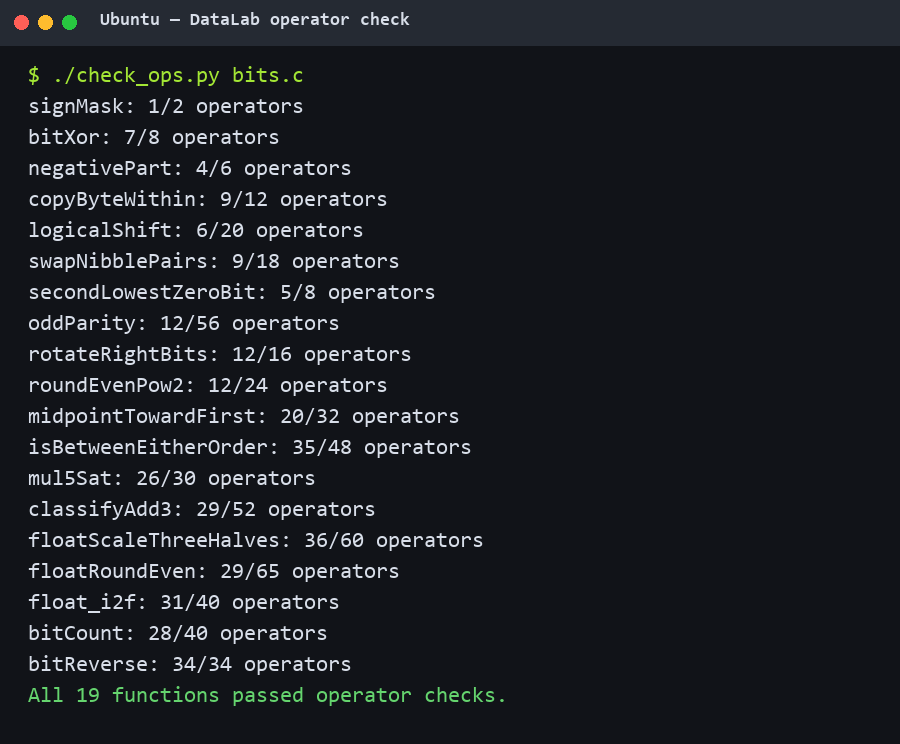
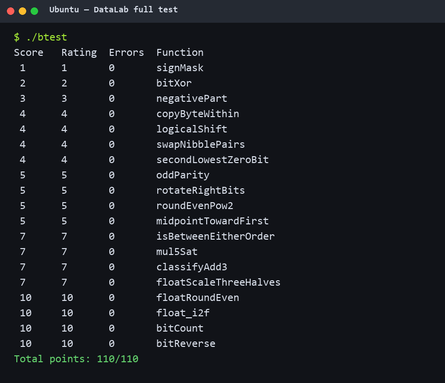

# Lab1: DataLab 实验报告

- 姓名：张圣皓
- 学号：25803050063

## 运行结果

`./check_ops.py bits.c`：

`./btest`：

## 实现思路

1. `signMask`：把 `1` 左移到最高位，直接得到符号位掩码。
2. `bitXor`：用德摩根律把异或改写成只含 `~` 和 `&` 的表达式。
3. `negativePart`：先用算术右移得到全 0 或全 1 的符号掩码，再选择 `-x` 或 0。
4. `copyByteWithin`：把源字节移到低位取出，清空目标字节后再移回去合并。
5. `logicalShift`：先做算术右移，再用按移位量生成的掩码清掉补进来的符号位。
6. `swapNibblePairs`：分别取出每个字节的高、低 4 位，向相反方向移动后合并。
7. `secondLowestZeroBit`：先把最低的 0 置 1，再从剩余位里隔离新的最低 0。
8. `oddParity`：不断把高半部分异或折叠到低半部分，最后取最低位并取反。
9. `rotateRightBits`：把移位量对 32 取模，分别算逻辑右移部分和回卷到高位的部分。
10. `roundEvenPow2`：用“半个单位减 1，再加商的奇偶位”作为偏置，刚好实现 ties-to-even。
11. `midpointTowardFirst`：用按位平均避免 `x+y` 溢出；和为奇数且 `x>y` 时再补 1。
12. `isBetweenEitherOrder`：分别做两次不会被符号溢出骗过的有符号比较，再处理端点相等。
13. `mul5Sat`：先算低 32 位乘积，同时和正负安全边界比较，溢出时按原符号选 `INT_MAX` 或 `INT_MIN`。
14. `classifyAdd3`：分两次相加记录正、负溢出；方向相反的两次溢出会抵消，否则返回对应方向。
15. `floatScaleThreeHalves`：拆出符号、阶码和尾数，用整数算出尾数的三倍，再按规格化位置右移并做 round-to-nearest-even；NaN 原样返回。
16. `floatRoundEven`：由阶码确定小数位数，比较余数和半程位置；正好一半时看保留整数的最低位。
17. `float_i2f`：取绝对值并找到最高 1 来确定阶码，超出 24 位的部分按 ties-to-even 舍入，最后补回符号位。
18. `bitCount`：用 `0x55`、`0x33`、`0x0F` 三组掩码分层累加 1 位、2 位、4 位小块中的位数。
19. `bitReverse`：依次交换相邻 1 位、2 位、4 位、8 位和 16 位块；几个掩码由前一个掩码推出来以满足操作数限制。

## 参考资料

- 课程 Lab1 实验文档
- 本仓库 `README.md` 与各函数题目注释
